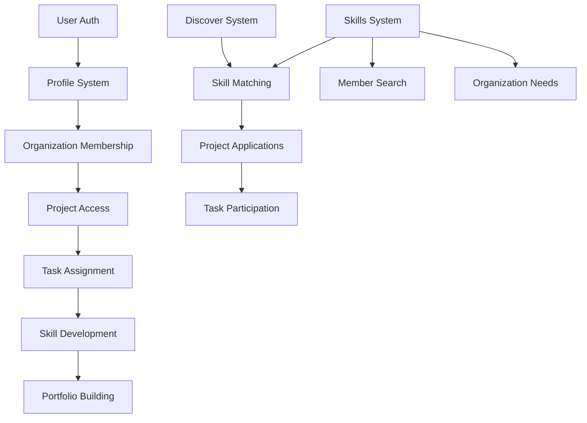

# Worktree v4 - Complete Feature Functionality Report
*Generated: June 30, 2025*

## Table of Contents
1. [Authentication & User Management](#authentication--user-management)
2. [User Profiles](#user-profiles)
3. [Organization Management](#organization-management)
4. [Project Discovery System](#project-discovery-system)
5. [Task Management System](#task-management-system)
6. [Skills System](#skills-system)
7. [Application System](#application-system)
8. [Analytics & Reporting](#analytics--reporting)
9. [System Interactions](#system-interactions)
10. [Database Schema Analysis](#database-schema-analysis)

---

## 1. Authentication & User Management

### ✅ FULLY WORKING:
- **Email/Password Authentication** via Supabase Auth
- **User Registration** with email verification
- **Login/Logout** with session management
- **Protected Routes** using middleware
- **User Type Selection** (Student, Org Leader, Admin)

### ⚠️ PARTIALLY WORKING:
- **Password Reset** - Backend works, frontend flow incomplete
- **Social Login** - Not implemented (OAuth ready in Supabase)

### ❌ NOT IMPLEMENTED:
- **Two-Factor Authentication**
- **SSO Integration** with university systems
- **Session timeout warnings**

---

## 2. User Profiles

### ✅ FULLY WORKING:
- **Basic Profile Info**: Name, username, bio, tagline
- **Avatar Upload** with image cropping (stored in Supabase Storage)
- **Academic Info**: Year of study, major, university
- **Skills Selection** from predefined skill list
- **Profile Viewing** at `/u/[username]`
- **Profile Editing** with real-time updates

### ⚠️ PARTIALLY WORKING:
- **Cover Photo** - Database field exists, upload UI not implemented
- **External Links** - Database supports, UI only shows GitHub/LinkedIn
- **Portfolio Section** - Basic display, needs enhancement

### ❌ NOT IMPLEMENTED:
- **Profile Privacy Settings**
- **Profile Export** (PDF/LinkedIn format)
- **Verification Badges** for students
- **Interest embeddings** (vector field exists, not populated)

---

## 3. Organization Management

### ✅ FULLY WORKING:
- **Organization Creation** with unique slugs
- **Organization Profiles** with full CRUD
  - Basic info (name, description, category)
  - Mission, values, what we do
  - Contact info, meeting schedule
  - Social media links
- **Member Management**
  - Add/remove members
  - Role assignment (admin, president, vice_president, etc.)
  - Member directory with search
- **Organization Switching** for users in multiple orgs
- **Logo Upload** to Supabase Storage

### ⚠️ PARTIALLY WORKING:
- **Email Invitations** - Database ready, no email service connected
- **Organization Analytics** - Table exists, not populated
- **Verification Status** - Field exists, no verification process

### ❌ NOT IMPLEMENTED:
- **Organization Deletion** workflow
- **Role Permissions** beyond basic admin check
- **Activity Feed** for organization updates
- **Founded date** tracking (field exists)

---

## 4. Project Discovery System

### ✅ FULLY WORKING:
- **Public Project Creation** from internal projects
- **Discover Feed** with multiple views:
  - "For You" page (50%+ skill match)
  - "All Projects" with pagination
- **Search & Filters**:
  - Text search on name/description
  - Low commitment filter (< 5 hours)
  - Deadline soon filter
  - Organization filter
- **Save Projects** functionality
- **Skill Matching** with match scores
- **Project Details Modal**
- **View Count** tracking

### ⚠️ PARTIALLY WORKING:
- **Application Requirements** - Field exists, not displayed
- **Preferred Start Date** - In database, not in UI
- **Max Applicants** - Tracked but no enforcement

### ❌ NOT IMPLEMENTED:
- **Project Categories/Tags**
- **Location-based filtering**
- **Recommended Projects** algorithm
- **Project Sharing** functionality

---

## 5. Task Management System

### ✅ FULLY WORKING:
- **Task Creation** with natural language input
- **Multiple Assignees** per task
- **Subtasks** (stored as JSONB)
- **Task Status** (pending, in_progress, completed)
- **Priority Levels** (low, medium, high, urgent)
- **Due Dates** with date picker
- **My Tasks View** with filters
- **Required/Preferred Skills** per task

### ⚠️ PARTIALLY WORKING:
- **Task Verification** - Verified_by field exists, no UI
- **Hours Tracking** - Fields exist, not fully integrated
- **Completion Quality** - Rating field unused

### ❌ NOT IMPLEMENTED:
- **Task Dependencies**
- **Recurring Tasks**
- **Task Templates**
- **Bulk Task Operations**
- **Task Comments/Discussion**

---

## 6. Skills System

### ✅ FULLY WORKING:
- **Skill Master List** with categories
- **Member Skills** tracking with sources:
  - Self-reported
  - Task-verified (partial)
  - Peer-endorsed (structure only)
- **Skill Search** in member directory
- **Skill Matching** for projects
- **Skills Aggregation** for organizations

### ⚠️ PARTIALLY WORKING:
- **Skill Verification** - Logic exists, not automated
- **Skill Progression** - Table exists, not populated
- **Endorsed By Count** - Field exists, no endorsement UI

### ❌ NOT IMPLEMENTED:
- **Skill Levels** (beginner, intermediate, expert)
- **Skill Recommendations**
- **Skill Gap Analysis**
- **Skill Embeddings** for semantic matching

---

## 7. Application System

### ✅ FULLY WORKING:
- **Project Applications** submission
- **Application Status** tracking
- **Cover Letter** input
- **Application Count** on projects
- **Skill Match Score** calculation
- **Applied Projects View**

### ⚠️ PARTIALLY WORKING:
- **Application Review** - Backend ready, no UI
- **Portfolio URLs** - Field exists, not in form
- **Reviewer Assignment** - Structure exists, no workflow

### ❌ NOT IMPLEMENTED:
- **Application Notifications**
- **Bulk Review Actions**
- **Application Deadlines** enforcement
- **Interview Scheduling**
- **Applicant Messaging**

---

## 8. Analytics & Reporting

### ⚠️ PARTIALLY WORKING:
- **Basic View Tracking** for projects
- **Organization Analytics** table (unpopulated)
- **User Activity** tracking structure

### ❌ NOT IMPLEMENTED:
- **Analytics Dashboards**
- **Engagement Reports**
- **Skill Gap Reports**
- **ROI Tracking**
- **Export Functionality**
- **Admin Analytics Panel**

---

## 9. System Interactions

### How Components Work Together:



### Key Data Flows:

1. **User Journey**:
   - Sign up → Create Profile → Join/Create Org → Work on Tasks → Build Portfolio

2. **Project Flow**:
   - Internal Project → Make Public → Discovery → Applications → Task Assignment

3. **Skill Flow**:
   - Self-report Skills → Use in Tasks → Get Verified → Show in Portfolio

### API/Database Interactions:

- **Supabase RPC Functions** optimize complex queries:
  - `get_projects_with_skills_and_status` - Discover feed
  - `get_organization_members_with_skills` - Member directory
  - `get_user_contributions_with_context` - Portfolio data

- **Real-time Subscriptions** (potential, not implemented):
  - Task updates
  - Application notifications
  - Organization activity

---

## 10. Database Schema Analysis

### Core Relationships:

1. **User-Centric**:
   ```
   profiles (1) → organization_members (N) → organizations
   profiles (1) → task_assignees (N) → contributions (tasks)
   profiles (1) → member_skills (N) → skills
   profiles (1) → project_applications (N) → internal_projects
   ```

2. **Organization-Centric**:
   ```
   organizations (1) → internal_projects (N)
   organizations (1) → organization_members (N) → profiles
   organizations (1) → organization_roles (N)
   ```

3. **Project-Centric**:
   ```
   internal_projects (1) → contributions (N) → task_assignees
   internal_projects (1) → project_applications (N)
   internal_projects → task_required_skills → skills
   ```

### Notable Schema Patterns:

- **UUIDs everywhere** for global uniqueness
- **JSONB fields** for flexibility (subtasks, social_links, metadata)
- **Array fields** for simple lists (skills, values)
- **Audit timestamps** on all tables
- **Status enums** for workflow states

### Unused/Partially Used Tables:

1. **opportunities** - Appears to be legacy, replaced by internal_projects
2. **applications** - Legacy, replaced by project_applications
3. **user_psychometrics** - Assessment system not implemented
4. **contextual_prompts** - Onboarding prompts not active
5. **skill_embeddings** - Vector fields exist but not populated

---

## What We CAN Currently Do:

1. **Complete User Flow**:
   - Register → Create profile → Join organizations → Apply to projects → Work on tasks

2. **Organization Management**:
   - Create orgs → Add members → Create projects → Assign tasks → Track progress

3. **Discovery & Matching**:
   - Browse projects → Filter by criteria → See skill matches → Save favorites → Apply

4. **Task Collaboration**:
   - Create tasks from text → Assign multiple people → Track subtasks → Mark complete

5. **Profile Building**:
   - Add skills → Complete tasks → Build contribution history → Public profile

## What We CANNOT Currently Do:

1. **Communication**:
   - No messaging system
   - No notifications (email or push)
   - No comments on tasks
   - No discussion forums

2. **Advanced Features**:
   - No AI-powered recommendations (beyond basic matching)
   - No automated skill verification
   - No calendar integration
   - No mobile app

3. **Analytics & Reporting**:
   - No dashboard visualizations
   - No exportable reports
   - No performance metrics
   - No engagement tracking

4. **Enterprise Features**:
   - No multi-tenant isolation
   - No SAML/SSO
   - No audit logs
   - No compliance reporting

5. **Workflow Automation**:
   - No automated reminders
   - No recurring tasks
   - No approval workflows
   - No integration with external tools

---

## Technical Limitations:

1. **Search**: Text-based only, no semantic/vector search despite embedding fields
2. **Real-time**: No WebSocket subscriptions implemented
3. **Offline**: No offline capability or PWA features
4. **Scale**: No caching layer (Redis), pagination only
5. **Media**: Images only, no document/video support

## Security Considerations:

- ✅ Row Level Security (RLS) on all tables
- ✅ JWT authentication
- ✅ HTTPS only
- ⚠️ No rate limiting beyond Supabase defaults
- ❌ No 2FA
- ❌ No security audit logs
- ❌ No PII encryption