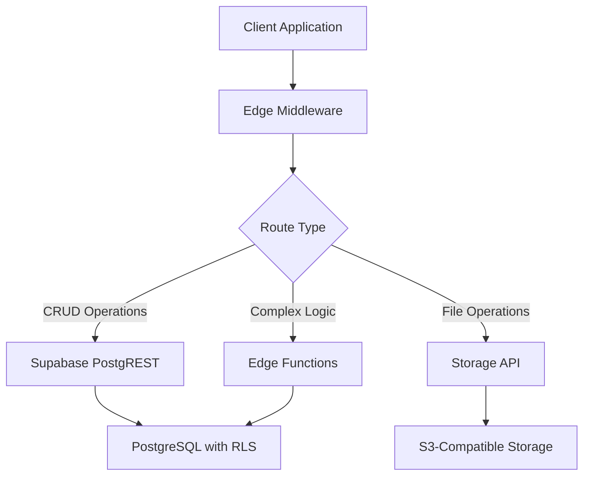

# Worktree v4 - API Specification & Security Guide

## Table of Contents
1. [API Architecture](#api-architecture)
2. [Authentication & Authorization](#authentication--authorization)
3. [API Endpoints](#api-endpoints)
4. [Security Best Practices](#security-best-practices)
5. [Rate Limiting & Throttling](#rate-limiting--throttling)
6. [Error Handling](#error-handling)
7. [Data Validation](#data-validation)
8. [Real-time APIs](#real-time-apis)

## API Architecture

### Overview
Worktree v4 uses a hybrid approach combining Supabase's auto-generated REST APIs with custom Edge Functions for complex business logic. All APIs follow RESTful principles and use JSON for data exchange.

### API Layers


## Authentication & Authorization

### 1. Authentication Flow
```typescript
// Authentication Methods
enum AuthMethod {
  EMAIL_PASSWORD = 'email_password',
  MAGIC_LINK = 'magic_link',
  OAUTH = 'oauth',
  UNIVERSITY_SSO = 'university_sso'
}

// Auth Flow
interface AuthFlow {
  // 1. Initial Authentication
  signUp(email: string, password: string): Promise<User>;
  signIn(method: AuthMethod, credentials: Credentials): Promise<Session>;
  
  // 2. Session Management
  refreshToken(refreshToken: string): Promise<Session>;
  signOut(sessionId: string): Promise<void>;
  
  // 3. Multi-Factor Authentication
  enableMFA(userId: string): Promise<MFASecret>;
  verifyMFA(userId: string, code: string): Promise<boolean>;
}
```

### 2. JWT Token Structure
```json
{
  "aud": "authenticated",
  "exp": 1234567890,
  "sub": "user-uuid",
  "email": "student@university.edu",
  "role": "student",
  "university_id": "university-uuid",
  "app_metadata": {
    "provider": "email",
    "providers": ["email"]
  },
  "user_metadata": {
    "first_name": "Sarah",
    "last_name": "Johnson"
  }
}
```

### 3. Authorization Levels
```typescript
enum Role {
  STUDENT = 'student',
  LEADER = 'leader',
  ADMIN = 'admin',
  ADVISOR = 'advisor'
}

// Row Level Security Policies
interface RLSPolicy {
  table: string;
  operation: 'SELECT' | 'INSERT' | 'UPDATE' | 'DELETE';
  check: string; // SQL expression
}

// Example Policies
const policies: RLSPolicy[] = [
  {
    table: 'projects',
    operation: 'SELECT',
    check: 'auth.uid() IN (SELECT user_id FROM project_members WHERE project_id = projects.id)'
  },
  {
    table: 'organizations',
    operation: 'UPDATE',
    check: 'auth.uid() IN (SELECT user_id FROM organization_members WHERE organization_id = organizations.id AND role IN ("leader", "advisor"))'
  }
];
```

## API Endpoints

### 1. User Management

#### Get User Profile
```http
GET /api/v1/users/{userId}
Authorization: Bearer <token>

Response 200:
{
  "id": "uuid",
  "email": "student@university.edu",
  "first_name": "Sarah",
  "last_name": "Johnson",
  "role": "student",
  "university": {
    "id": "uuid",
    "name": "Stanford University"
  },
  "skills": [
    {
      "id": "uuid",
      "name": "Python",
      "level": "intermediate",
      "endorsed_count": 5
    }
  ],
  "stats": {
    "projects_completed": 12,
    "skills_verified": 8,
    "organizations": 3
  }
}
```

#### Update User Profile
```http
PATCH /api/v1/users/{userId}
Authorization: Bearer <token>
Content-Type: application/json

{
  "first_name": "Sarah",
  "last_name": "Johnson",
  "bio": "Computer Science major passionate about AI",
  "graduation_year": 2025,
  "major": "Computer Science"
}

Response 200:
{
  "id": "uuid",
  "updated_at": "2024-01-20T10:00:00Z"
}
```

### 2. Skills Management

#### Search Skills
```http
GET /api/v1/skills/search?q=python&category=programming
Authorization: Bearer <token>

Response 200:
{
  "data": [
    {
      "id": "uuid",
      "name": "Python",
      "category": "Programming Languages",
      "description": "High-level programming language",
      "user_count": 1250,
      "project_count": 89
    }
  ],
  "meta": {
    "total": 5,
    "page": 1,
    "per_page": 20
  }
}
```

#### Add Skill to Profile
```http
POST /api/v1/users/{userId}/skills
Authorization: Bearer <token>
Content-Type: application/json

{
  "skill_id": "uuid",
  "level": "intermediate",
  "evidence": "Completed CS101 with Python"
}

Response 201:
{
  "id": "uuid",
  "user_id": "uuid",
  "skill_id": "uuid",
  "level": "intermediate",
  "source": "self_assessed",
  "created_at": "2024-01-20T10:00:00Z"
}
```

### 3. Project Management

#### Create Project
```http
POST /api/v1/organizations/{orgId}/projects
Authorization: Bearer <token>
Content-Type: application/json

{
  "name": "Campus Sustainability App",
  "description": "Mobile app to track campus carbon footprint",
  "required_skills": ["uuid1", "uuid2"],
  "start_date": "2024-02-01",
  "end_date": "2024-05-01",
  "max_members": 5
}

Response 201:
{
  "id": "uuid",
  "organization_id": "uuid",
  "name": "Campus Sustainability App",
  "status": "planning",
  "created_at": "2024-01-20T10:00:00Z"
}
```

#### Apply to Project
```http
POST /api/v1/projects/{projectId}/applications
Authorization: Bearer <token>
Content-Type: application/json

{
  "cover_letter": "I'm excited about sustainability and have experience with React Native...",
  "available_hours_per_week": 10
}

Response 201:
{
  "id": "uuid",
  "project_id": "uuid",
  "user_id": "uuid",
  "status": "pending",
  "submitted_at": "2024-01-20T10:00:00Z"
}
```

### 4. Analytics APIs (Edge Functions)

#### Get Organization Analytics
```http
GET /api/v1/analytics/organizations/{orgId}
Authorization: Bearer <token>
X-Time-Range: 30d

Response 200:
{
  "overview": {
    "total_members": 45,
    "active_projects": 3,
    "completed_projects": 12,
    "total_skills_developed": 89
  },
  "engagement": {
    "weekly_active_members": 38,
    "avg_hours_per_member": 4.5,
    "participation_rate": 0.84
  },
  "skill_distribution": [
    {
      "skill": "Project Management",
      "count": 12,
      "percentage": 0.27
    }
  ],
  "trends": {
    "member_growth": [
      {"date": "2024-01-01", "count": 40},
      {"date": "2024-01-08", "count": 42}
    ]
  }
}
```

## Security Best Practices

### 1. Input Validation
```typescript
// Zod Schema Example
import { z } from 'zod';

const CreateProjectSchema = z.object({
  name: z.string().min(3).max(100),
  description: z.string().min(10).max(1000),
  required_skills: z.array(z.string().uuid()).max(10),
  start_date: z.string().datetime(),
  end_date: z.string().datetime(),
  max_members: z.number().int().min(1).max(50)
}).refine(data => new Date(data.end_date) > new Date(data.start_date), {
  message: "End date must be after start date"
});

// Validation Middleware
export async function validateRequest(schema: ZodSchema) {
  return async (req: Request) => {
    try {
      const body = await req.json();
      const validated = schema.parse(body);
      return validated;
    } catch (error) {
      throw new ValidationError(error);
    }
  };
}
```

### 2. SQL Injection Prevention
```typescript
// Never use string concatenation
// BAD
const query = `SELECT * FROM users WHERE email = '${email}'`;

// GOOD - Use parameterized queries
const { data, error } = await supabase
  .from('users')
  .select('*')
  .eq('email', email);

// For complex queries in Edge Functions
const { data, error } = await supabase.rpc('complex_query', {
  param1: value1,
  param2: value2
});
```

### 3. XSS Prevention
```typescript
// Content Security Policy
export const cspHeader = {
  'Content-Security-Policy': [
    "default-src 'self'",
    "script-src 'self' 'unsafe-inline' 'unsafe-eval' https://vercel.live",
    "style-src 'self' 'unsafe-inline'",
    "img-src 'self' data: https:",
    "font-src 'self'",
    "connect-src 'self' https://*.supabase.co wss://*.supabase.co",
    "frame-ancestors 'none'",
    "base-uri 'self'",
    "form-action 'self'"
  ].join('; ')
};

// Sanitize user input
import DOMPurify from 'isomorphic-dompurify';

export function sanitizeHTML(dirty: string): string {
  return DOMPurify.sanitize(dirty, {
    ALLOWED_TAGS: ['b', 'i', 'em', 'strong', 'a', 'p', 'br'],
    ALLOWED_ATTR: ['href', 'target', 'rel']
  });
}
```

## Rate Limiting & Throttling

### 1. Rate Limit Configuration
```typescript
// Edge Middleware Rate Limiting
import { Ratelimit } from '@upstash/ratelimit';
import { Redis } from '@upstash/redis';

const ratelimit = new Ratelimit({
  redis: Redis.fromEnv(),
  limiter: Ratelimit.slidingWindow(10, '10 s'),
  analytics: true,
});

export async function rateLimitMiddleware(req: Request) {
  const ip = req.headers.get('x-forwarded-for') ?? 'anonymous';
  const { success, limit, reset, remaining } = await ratelimit.limit(ip);
  
  if (!success) {
    return new Response('Too Many Requests', {
      status: 429,
      headers: {
        'X-RateLimit-Limit': limit.toString(),
        'X-RateLimit-Remaining': remaining.toString(),
        'X-RateLimit-Reset': new Date(reset).toISOString(),
      },
    });
  }
}
```

### 2. API Quotas by User Type
```typescript
const quotas = {
  student: {
    requests_per_minute: 60,
    requests_per_hour: 1000,
    projects_per_month: 10,
    applications_per_day: 20
  },
  leader: {
    requests_per_minute: 120,
    requests_per_hour: 3000,
    bulk_operations_per_day: 100
  },
  admin: {
    requests_per_minute: 300,
    requests_per_hour: 10000,
    export_operations_per_day: 50
  }
};
```

## Error Handling

### 1. Error Response Format
```typescript
interface ErrorResponse {
  error: {
    code: string;
    message: string;
    details?: any;
    request_id: string;
    timestamp: string;
  };
}

// Error Codes
enum ErrorCode {
  // Client Errors
  VALIDATION_ERROR = 'VALIDATION_ERROR',
  UNAUTHORIZED = 'UNAUTHORIZED',
  FORBIDDEN = 'FORBIDDEN',
  NOT_FOUND = 'NOT_FOUND',
  CONFLICT = 'CONFLICT',
  RATE_LIMITED = 'RATE_LIMITED',
  
  // Server Errors
  INTERNAL_ERROR = 'INTERNAL_ERROR',
  DATABASE_ERROR = 'DATABASE_ERROR',
  EXTERNAL_SERVICE_ERROR = 'EXTERNAL_SERVICE_ERROR'
}
```

### 2. Error Handler Implementation
```typescript
export class APIError extends Error {
  constructor(
    public code: ErrorCode,
    public statusCode: number,
    public message: string,
    public details?: any
  ) {
    super(message);
  }
}

export function errorHandler(error: unknown): Response {
  const requestId = crypto.randomUUID();
  
  if (error instanceof APIError) {
    return new Response(JSON.stringify({
      error: {
        code: error.code,
        message: error.message,
        details: error.details,
        request_id: requestId,
        timestamp: new Date().toISOString()
      }
    }), {
      status: error.statusCode,
      headers: { 'Content-Type': 'application/json' }
    });
  }
  
  // Log unexpected errors
  console.error(`Unexpected error [${requestId}]:`, error);
  
  return new Response(JSON.stringify({
    error: {
      code: ErrorCode.INTERNAL_ERROR,
      message: 'An unexpected error occurred',
      request_id: requestId,
      timestamp: new Date().toISOString()
    }
  }), {
    status: 500,
    headers: { 'Content-Type': 'application/json' }
  });
}
```

## Data Validation

### 1. Request Validation Schemas
```typescript
// Common Validation Rules
const validationRules = {
  uuid: z.string().uuid(),
  email: z.string().email().endsWith('.edu'),
  url: z.string().url().startsWith('https://'),
  date: z.string().datetime(),
  pagination: z.object({
    page: z.number().int().positive().default(1),
    per_page: z.number().int().min(1).max(100).default(20)
  })
};

// Complex Validation Example
const CreateEventSchema = z.object({
  name: z.string().min(3).max(100),
  description: z.string().max(1000).optional(),
  start_time: z.string().datetime(),
  end_time: z.string().datetime(),
  location_type: z.enum(['virtual', 'physical']),
  location_details: z.string().max(200),
  capacity: z.number().int().positive().optional(),
  tags: z.array(z.string()).max(5).optional()
}).refine(data => {
  const start = new Date(data.start_time);
  const end = new Date(data.end_time);
  return end > start && start > new Date();
}, {
  message: "Event must be in the future and end after start"
});
```

## Real-time APIs

### 1. WebSocket Subscriptions
```typescript
// Client-side subscription
const subscription = supabase
  .channel('project-updates')
  .on('postgres_changes', {
    event: '*',
    schema: 'public',
    table: 'projects',
    filter: `organization_id=eq.${orgId}`
  }, (payload) => {
    handleProjectUpdate(payload);
  })
  .subscribe();

// Server-side broadcast
await supabase.channel('notifications')
  .send({
    type: 'broadcast',
    event: 'new-application',
    payload: {
      project_id: projectId,
      applicant_name: applicantName,
      timestamp: new Date().toISOString()
    }
  });
```

### 2. Presence & Live Cursors
```typescript
// Track online users in organization
const presence = supabase.channel(`org-${orgId}-presence`)
  .on('presence', { event: 'sync' }, () => {
    const state = presence.presenceState();
    updateOnlineMembers(state);
  })
  .subscribe(async (status) => {
    if (status === 'SUBSCRIBED') {
      await presence.track({
        user_id: userId,
        online_at: new Date().toISOString()
      });
    }
  });
```

This API specification provides a secure, scalable foundation for the Worktree platform with comprehensive security measures and best practices built in from the ground up.