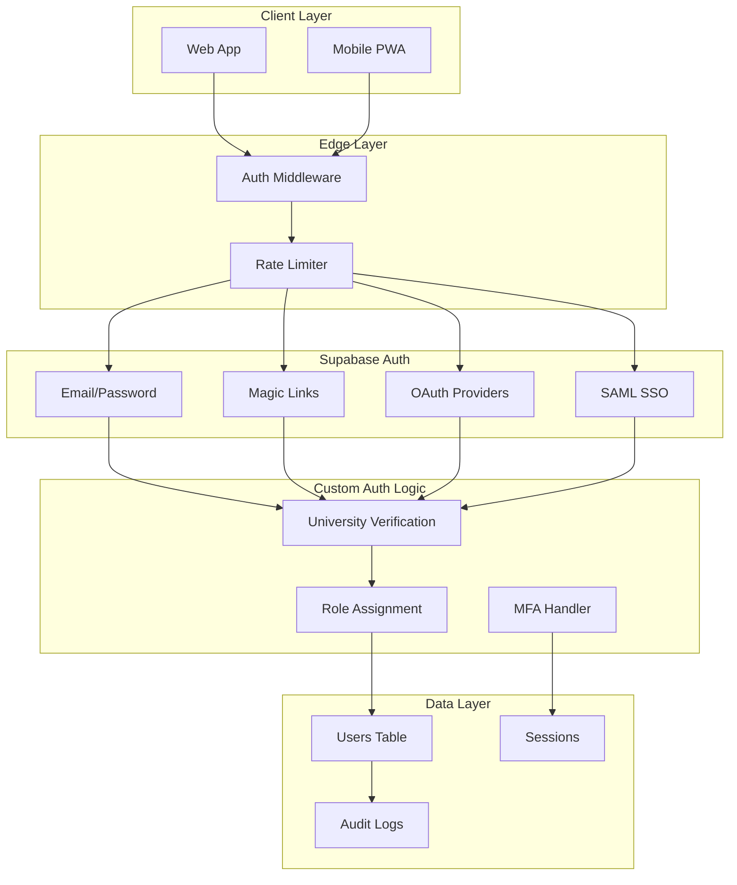
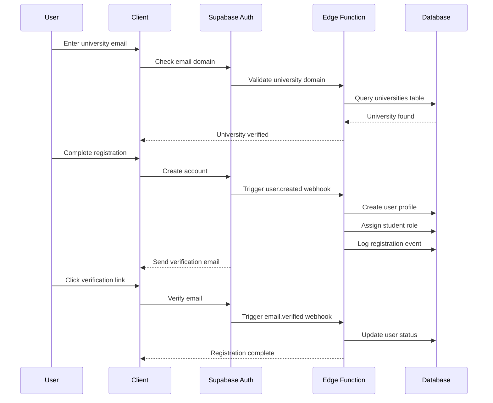
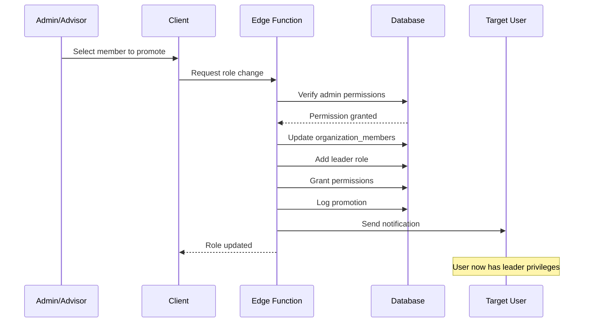
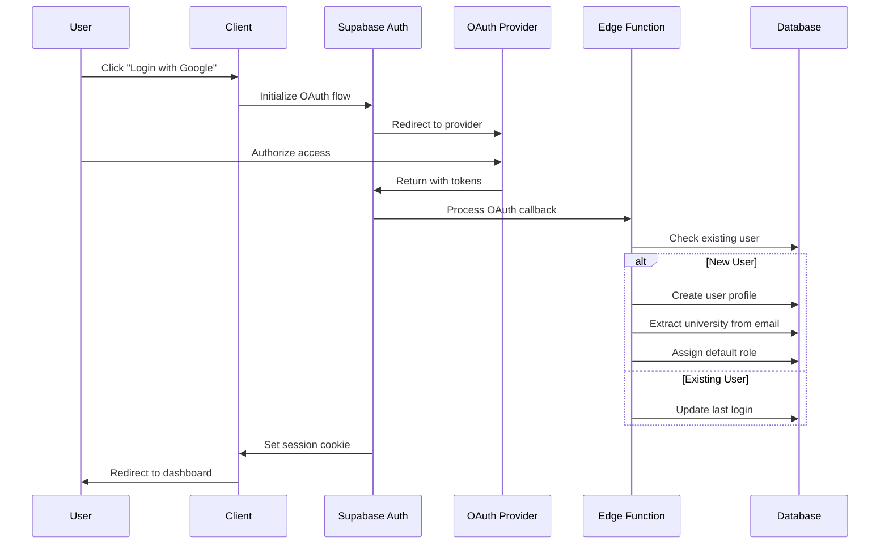
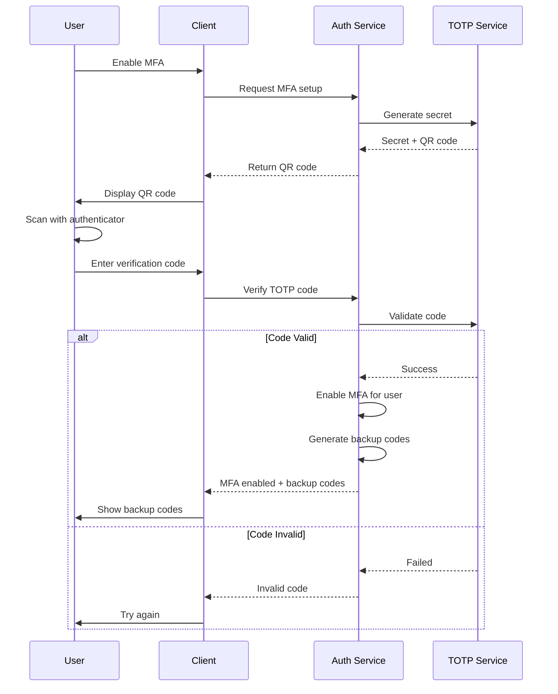
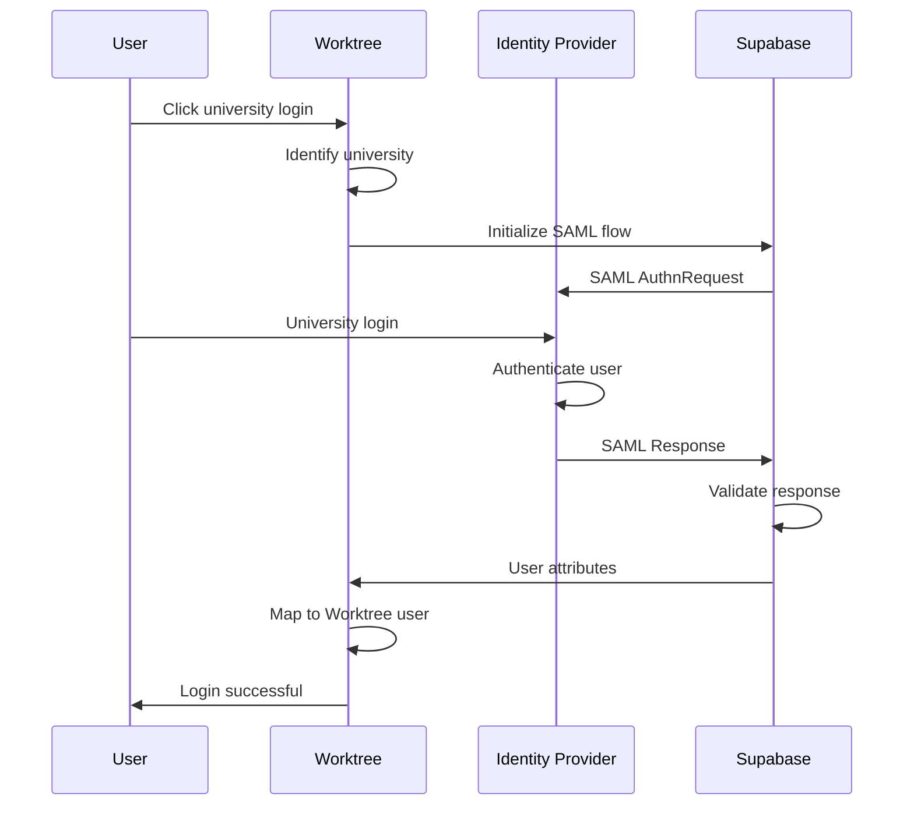

# Worktree v4 - Authentication & Authorization Architecture

## Table of Contents
1. [Authentication Overview](#authentication-overview)
2. [Authentication Flows](#authentication-flows)
3. [Authorization Model](#authorization-model)
4. [Security Implementation](#security-implementation)
5. [Session Management](#session-management)
6. [Multi-Factor Authentication](#multi-factor-authentication)
7. [University SSO Integration](#university-sso-integration)

## Authentication Overview

Worktree uses Supabase Auth as the primary authentication provider, enhanced with custom logic for university verification and role-based access control.

### Authentication Architecture


## Authentication Flows

### 1. Student Registration Flow


### 2. Organization Leader Promotion Flow


### 3. OAuth Login Flow (Google/GitHub)


## Authorization Model

### 1. Role-Based Access Control (RBAC)
```typescript
// Role Hierarchy
enum Role {
  STUDENT = 'student',        // Basic user
  LEADER = 'leader',          // Organization leader
  ADVISOR = 'advisor',        // Faculty advisor
  ADMIN = 'admin'            // University admin
}

// Permission Matrix
const permissions = {
  student: [
    'profile.read.own',
    'profile.update.own',
    'skills.add.own',
    'projects.view.public',
    'projects.apply',
    'organizations.join'
  ],
  
  leader: [
    ...permissions.student,
    'organization.update.own',
    'projects.create',
    'projects.manage.own',
    'members.view.own',
    'members.invite',
    'events.create',
    'analytics.view.own'
  ],
  
  advisor: [
    ...permissions.leader,
    'organization.verify',
    'members.approve',
    'reports.generate'
  ],
  
  admin: [
    '*' // All permissions
  ]
};
```

### 2. Resource-Based Access Control
```sql
-- Project visibility rules
CREATE POLICY project_access ON projects
FOR SELECT USING (
  -- Public projects visible to all
  visibility = 'public' OR
  
  -- Members-only visible to org members
  (visibility = 'members_only' AND EXISTS (
    SELECT 1 FROM organization_members om
    WHERE om.organization_id = projects.organization_id
    AND om.user_id = auth.uid()
    AND om.is_active = true
  )) OR
  
  -- Invite-only visible to project members
  (visibility = 'invite_only' AND EXISTS (
    SELECT 1 FROM project_members pm
    WHERE pm.project_id = projects.id
    AND pm.user_id = auth.uid()
  ))
);
```

### 3. Dynamic Permission Checks
```typescript
// Edge Function permission middleware
export async function checkPermission(
  userId: string,
  resource: string,
  action: string,
  context?: any
): Promise<boolean> {
  // Get user's roles
  const { data: userRoles } = await supabase
    .from('users')
    .select('role')
    .eq('id', userId)
    .single();
  
  // Check static permissions
  if (hasStaticPermission(userRoles.role, `${resource}.${action}`)) {
    return true;
  }
  
  // Check dynamic permissions
  switch (resource) {
    case 'project':
      return checkProjectPermission(userId, action, context.projectId);
    case 'organization':
      return checkOrgPermission(userId, action, context.orgId);
    default:
      return false;
  }
}
```

## Security Implementation

### 1. JWT Token Structure
```typescript
interface WorktreeJWT {
  // Standard claims
  aud: string;
  exp: number;
  sub: string; // User ID
  email: string;
  iat: number;
  iss: string;
  
  // Custom claims
  app_metadata: {
    provider: string;
    providers: string[];
    university_id: string;
    role: Role;
    organization_roles: {
      [orgId: string]: string;
    };
  };
  
  user_metadata: {
    first_name: string;
    last_name: string;
    avatar_url?: string;
  };
}
```

### 2. Secure Cookie Configuration
```typescript
// Session cookie settings
export const cookieOptions = {
  name: 'worktree-auth',
  httpOnly: true,
  secure: true, // HTTPS only
  sameSite: 'lax' as const,
  maxAge: 60 * 60 * 24 * 7, // 7 days
  path: '/',
  domain: process.env.COOKIE_DOMAIN
};

// CSRF Protection
export const csrfOptions = {
  cookie: {
    name: 'worktree-csrf',
    httpOnly: false, // Readable by JS
    secure: true,
    sameSite: 'strict' as const
  }
};
```

### 3. API Security Headers
```typescript
// Security middleware
export function securityHeaders(): Headers {
  return new Headers({
    'X-Frame-Options': 'DENY',
    'X-Content-Type-Options': 'nosniff',
    'X-XSS-Protection': '1; mode=block',
    'Referrer-Policy': 'strict-origin-when-cross-origin',
    'Permissions-Policy': 'camera=(), microphone=(), geolocation=()',
    'Strict-Transport-Security': 'max-age=31536000; includeSubDomains',
    'Content-Security-Policy': generateCSP()
  });
}
```

## Session Management

### 1. Session Lifecycle
```typescript
// Session creation
async function createSession(userId: string): Promise<Session> {
  const sessionId = crypto.randomUUID();
  const expiresAt = new Date(Date.now() + SESSION_DURATION);
  
  // Store in database
  const { data: session } = await supabase
    .from('sessions')
    .insert({
      id: sessionId,
      user_id: userId,
      expires_at: expiresAt,
      ip_address: getClientIP(),
      user_agent: getUserAgent()
    })
    .select()
    .single();
  
  // Set Redis cache for fast lookup
  await redis.setex(
    `session:${sessionId}`,
    SESSION_DURATION / 1000,
    JSON.stringify(session)
  );
  
  return session;
}

// Session refresh
async function refreshSession(sessionId: string): Promise<Session> {
  const session = await getSession(sessionId);
  
  if (!session || session.expires_at < new Date()) {
    throw new Error('Session expired');
  }
  
  // Extend expiration
  const newExpiration = new Date(Date.now() + SESSION_DURATION);
  
  await supabase
    .from('sessions')
    .update({ 
      expires_at: newExpiration,
      last_activity: new Date()
    })
    .eq('id', sessionId);
  
  // Update cache
  await redis.expire(`session:${sessionId}`, SESSION_DURATION / 1000);
  
  return { ...session, expires_at: newExpiration };
}
```

### 2. Concurrent Session Management
```typescript
// Limit concurrent sessions
const MAX_SESSIONS_PER_USER = 3;

async function enforceSessionLimit(userId: string): Promise<void> {
  const { data: sessions } = await supabase
    .from('sessions')
    .select('id, created_at')
    .eq('user_id', userId)
    .gt('expires_at', new Date())
    .order('created_at', { ascending: false });
  
  if (sessions.length > MAX_SESSIONS_PER_USER) {
    // Revoke oldest sessions
    const toRevoke = sessions.slice(MAX_SESSIONS_PER_USER);
    
    for (const session of toRevoke) {
      await revokeSession(session.id);
    }
  }
}
```

## Multi-Factor Authentication

### 1. MFA Setup Flow


### 2. MFA Implementation
```typescript
// MFA setup
export async function setupMFA(userId: string): Promise<MFASetup> {
  // Generate secret
  const secret = authenticator.generateSecret();
  
  // Generate QR code
  const otpauth = authenticator.keyuri(
    userId,
    'Worktree',
    secret
  );
  
  const qrCode = await QRCode.toDataURL(otpauth);
  
  // Store encrypted secret temporarily
  await redis.setex(
    `mfa_setup:${userId}`,
    600, // 10 minutes
    encrypt(secret)
  );
  
  return { qrCode, secret };
}

// MFA verification
export async function verifyMFASetup(
  userId: string, 
  code: string
): Promise<boolean> {
  // Get temporary secret
  const encryptedSecret = await redis.get(`mfa_setup:${userId}`);
  if (!encryptedSecret) throw new Error('MFA setup expired');
  
  const secret = decrypt(encryptedSecret);
  
  // Verify code
  const isValid = authenticator.verify({
    token: code,
    secret: secret
  });
  
  if (isValid) {
    // Save to database
    await supabase
      .from('user_mfa')
      .insert({
        user_id: userId,
        secret: encrypt(secret),
        backup_codes: generateBackupCodes(),
        enabled: true
      });
    
    // Clean up temporary storage
    await redis.del(`mfa_setup:${userId}`);
  }
  
  return isValid;
}
```

## University SSO Integration

### 1. SAML SSO Flow


### 2. SSO Configuration
```typescript
// University SSO settings
interface SSOConfig {
  university_id: string;
  provider: 'saml' | 'oidc';
  enabled: boolean;
  
  // SAML specific
  saml?: {
    sso_url: string;
    entity_id: string;
    x509_cert: string;
    attribute_mapping: {
      email: string;
      first_name: string;
      last_name: string;
      student_id?: string;
    };
  };
  
  // OIDC specific
  oidc?: {
    issuer: string;
    client_id: string;
    client_secret: string;
    scopes: string[];
  };
}

// SSO handler
export async function handleSSOCallback(
  provider: string,
  profile: any
): Promise<User> {
  // Extract university from provider
  const universityId = extractUniversityId(provider);
  
  // Map attributes
  const userData = mapSSOAttributes(profile, universityId);
  
  // Create or update user
  const { data: user } = await supabase
    .from('users')
    .upsert({
      email: userData.email,
      university_id: universityId,
      first_name: userData.first_name,
      last_name: userData.last_name,
      sso_provider: provider,
      email_verified_at: new Date() // SSO implies verified
    })
    .select()
    .single();
  
  return user;
}
```

### 3. Automatic Role Assignment
```typescript
// Role assignment based on SSO attributes
async function assignRoleFromSSO(
  userId: string,
  attributes: any
): Promise<void> {
  let role: Role = Role.STUDENT;
  
  // Check faculty/staff indicators
  if (attributes.employee_type === 'faculty') {
    role = Role.ADVISOR;
  } else if (attributes.groups?.includes('admins')) {
    role = Role.ADMIN;
  }
  
  // Update user role
  await supabase
    .from('users')
    .update({ role })
    .eq('id', userId);
  
  // Log role assignment
  await auditLog({
    user_id: userId,
    action: 'role_assigned',
    details: {
      role,
      source: 'sso',
      attributes
    }
  });
}
```

This authentication and authorization architecture provides a secure, flexible foundation for Worktree while maintaining excellent user experience and supporting various authentication methods including university SSO integration.