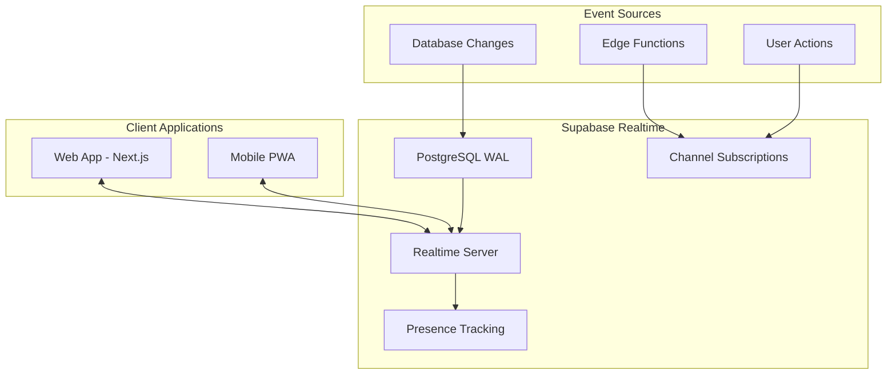

# Worktree v4 - Real-time Features Architecture

## Table of Contents
1. [Real-time Overview](#real-time-overview)
2. [Notification System](#notification-system)
3. [Live Collaboration](#live-collaboration)
4. [Activity Feeds](#activity-feeds)
5. [Presence System](#presence-system)
6. [Real-time Analytics](#real-time-analytics)
7. [Implementation Guide](#implementation-guide)

## Real-time Overview

Worktree leverages Supabase Realtime to deliver instant updates across the platform, creating a dynamic and engaging experience for students, organization leaders, and administrators.

### Architecture Overview


### Core Real-time Features
1. **Instant Notifications** - Application updates, deadlines, endorsements
2. **Live Collaboration** - Project boards, shared documents, task updates
3. **Activity Feeds** - Organization updates, member activities
4. **Presence Indicators** - Online status, active users in projects
5. **Real-time Analytics** - Live engagement metrics, attendance tracking

## Notification System

### 1. Notification Types and Channels
```typescript
enum NotificationType {
  // Application & Opportunities
  APPLICATION_SUBMITTED = 'application_submitted',
  APPLICATION_ACCEPTED = 'application_accepted',
  APPLICATION_REJECTED = 'application_rejected',
  NEW_OPPORTUNITY_MATCH = 'new_opportunity_match',
  APPLICATION_DEADLINE = 'application_deadline',
  
  // Projects & Tasks
  TASK_ASSIGNED = 'task_assigned',
  TASK_DUE_SOON = 'task_due_soon',
  PROJECT_UPDATE = 'project_update',
  PROJECT_MILESTONE = 'project_milestone',
  
  // Social & Recognition
  SKILL_ENDORSED = 'skill_endorsed',
  ACHIEVEMENT_UNLOCKED = 'achievement_unlocked',
  MENTIONED_IN_PROJECT = 'mentioned_in_project',
  
  // Organization
  ORG_ANNOUNCEMENT = 'org_announcement',
  EVENT_REMINDER = 'event_reminder',
  MEETING_STARTING = 'meeting_starting',
  
  // Admin
  APPROVAL_REQUIRED = 'approval_required',
  REPORT_READY = 'report_ready'
}

interface NotificationChannel {
  inApp: boolean;
  email: boolean;
  push: boolean;
  sms?: boolean;
}
```

### 2. Real-time Notification Implementation
```typescript
// Server-side: Trigger notification
async function sendNotification(notification: Notification) {
  // Insert into notifications table
  const { data } = await supabase
    .from('notifications')
    .insert({
      user_id: notification.userId,
      type: notification.type,
      title: notification.title,
      body: notification.body,
      data: notification.data,
      read: false
    })
    .select()
    .single();
  
  // Broadcast via Realtime
  await supabase.channel(`user-${notification.userId}`)
    .send({
      type: 'broadcast',
      event: 'new_notification',
      payload: data
    });
  
  // Queue email/push if enabled
  if (notification.channels.email) {
    await queueEmail(notification);
  }
  if (notification.channels.push) {
    await queuePushNotification(notification);
  }
}

// Client-side: Subscribe to notifications
function useNotifications(userId: string) {
  const [notifications, setNotifications] = useState<Notification[]>([]);
  
  useEffect(() => {
    // Initial fetch
    fetchNotifications();
    
    // Subscribe to real-time updates
    const subscription = supabase
      .channel(`user-${userId}`)
      .on('broadcast', { event: 'new_notification' }, (payload) => {
        setNotifications(prev => [payload.payload, ...prev]);
        
        // Show toast notification
        showToast({
          title: payload.payload.title,
          description: payload.payload.body,
          action: payload.payload.action
        });
        
        // Update badge count
        updateNotificationBadge();
      })
      .subscribe();
    
    return () => {
      subscription.unsubscribe();
    };
  }, [userId]);
  
  return { notifications, markAsRead, deleteNotification };
}
```

### 3. Smart Notification Preferences
```typescript
interface NotificationPreferences {
  // Global settings
  enabled: boolean;
  quiet_hours: {
    enabled: boolean;
    start: string; // "22:00"
    end: string;   // "08:00"
    timezone: string;
  };
  
  // Per-type preferences
  preferences: {
    [key in NotificationType]: {
      inApp: boolean;
      email: boolean;
      push: boolean;
      frequency?: 'instant' | 'daily_digest' | 'weekly_digest';
    };
  };
  
  // Smart filters
  filters: {
    min_opportunity_match_score: number; // 0-1
    only_from_my_orgs: boolean;
    priority_skills_only: boolean;
  };
}
```

## Live Collaboration

### 1. Project Board Real-time Updates
```typescript
// Collaborative Kanban Board
function ProjectBoard({ projectId }: { projectId: string }) {
  const [tasks, setTasks] = useState<Task[]>([]);
  const [onlineMembers, setOnlineMembers] = useState<User[]>([]);
  
  useEffect(() => {
    // Subscribe to task changes
    const taskSubscription = supabase
      .channel(`project-${projectId}-tasks`)
      .on('postgres_changes', {
        event: '*',
        schema: 'public',
        table: 'tasks',
        filter: `project_id=eq.${projectId}`
      }, (payload) => {
        handleTaskChange(payload);
      })
      .subscribe();
    
    // Subscribe to presence
    const presenceSubscription = supabase
      .channel(`project-${projectId}-presence`)
      .on('presence', { event: 'sync' }, () => {
        const state = presenceSubscription.presenceState();
        setOnlineMembers(Object.values(state).flat());
      })
      .on('presence', { event: 'join' }, ({ key, newPresences }) => {
        showToast(`${newPresences[0].user_name} joined the project`);
      })
      .subscribe(async (status) => {
        if (status === 'SUBSCRIBED') {
          await presenceSubscription.track({
            user_id: currentUser.id,
            user_name: currentUser.name,
            avatar_url: currentUser.avatar
          });
        }
      });
    
    return () => {
      taskSubscription.unsubscribe();
      presenceSubscription.unsubscribe();
    };
  }, [projectId]);
  
  const handleTaskChange = (payload: RealtimePostgresChangesPayload) => {
    switch (payload.eventType) {
      case 'INSERT':
        setTasks(prev => [...prev, payload.new as Task]);
        break;
      case 'UPDATE':
        setTasks(prev => prev.map(task => 
          task.id === payload.new.id ? payload.new as Task : task
        ));
        break;
      case 'DELETE':
        setTasks(prev => prev.filter(task => task.id !== payload.old.id));
        break;
    }
  };
  
  return (
    <div>
      <OnlineIndicators members={onlineMembers} />
      <KanbanBoard tasks={tasks} onTaskMove={moveTask} />
    </div>
  );
}
```

### 2. Live Cursor Tracking
```typescript
// Show where team members are working
interface CursorPosition {
  user_id: string;
  x: number;
  y: number;
  element_id?: string;
  user_name: string;
  color: string;
}

function useLiveCursors(channelId: string) {
  const [cursors, setCursors] = useState<Map<string, CursorPosition>>(new Map());
  const cursorChannel = useRef<RealtimeChannel>();
  
  useEffect(() => {
    cursorChannel.current = supabase
      .channel(`${channelId}-cursors`)
      .on('broadcast', { event: 'cursor_move' }, ({ payload }) => {
        setCursors(prev => {
          const next = new Map(prev);
          next.set(payload.user_id, payload);
          return next;
        });
      })
      .on('presence', { event: 'leave' }, ({ key }) => {
        setCursors(prev => {
          const next = new Map(prev);
          next.delete(key);
          return next;
        });
      })
      .subscribe();
    
    // Track mouse movements (throttled)
    const handleMouseMove = throttle((e: MouseEvent) => {
      cursorChannel.current?.send({
        type: 'broadcast',
        event: 'cursor_move',
        payload: {
          user_id: currentUser.id,
          x: e.clientX,
          y: e.clientY,
          user_name: currentUser.name,
          color: currentUser.color
        }
      });
    }, 50);
    
    document.addEventListener('mousemove', handleMouseMove);
    
    return () => {
      document.removeEventListener('mousemove', handleMouseMove);
      cursorChannel.current?.unsubscribe();
    };
  }, [channelId]);
  
  return cursors;
}
```

## Activity Feeds

### 1. Organization Activity Stream
```typescript
// Real-time activity feed for organizations
interface Activity {
  id: string;
  type: 'member_joined' | 'project_created' | 'event_scheduled' | 'milestone_reached';
  actor: User;
  target?: any;
  metadata: any;
  created_at: string;
}

function OrganizationActivityFeed({ orgId }: { orgId: string }) {
  const [activities, setActivities] = useState<Activity[]>([]);
  const [liveViewers, setLiveViewers] = useState(0);
  
  useEffect(() => {
    // Fetch initial activities
    fetchActivities();
    
    // Subscribe to new activities
    const activityChannel = supabase
      .channel(`org-${orgId}-activity`)
      .on('postgres_changes', {
        event: 'INSERT',
        schema: 'public',
        table: 'organization_activities',
        filter: `organization_id=eq.${orgId}`
      }, (payload) => {
        const newActivity = payload.new as Activity;
        
        // Add to feed with animation
        setActivities(prev => [newActivity, ...prev].slice(0, 50));
        
        // Show live indicator
        showLiveIndicator(newActivity);
      })
      .on('presence', { event: 'sync' }, () => {
        const state = activityChannel.presenceState();
        setLiveViewers(Object.keys(state).length);
      })
      .subscribe(async (status) => {
        if (status === 'SUBSCRIBED') {
          await activityChannel.track({ user_id: currentUser.id });
        }
      });
    
    return () => {
      activityChannel.unsubscribe();
    };
  }, [orgId]);
  
  return (
    <div className="activity-feed">
      <LiveViewerCount count={liveViewers} />
      <ActivityList activities={activities} />
    </div>
  );
}
```

### 2. Smart Activity Aggregation
```typescript
// Aggregate similar activities to reduce noise
function aggregateActivities(activities: Activity[]): AggregatedActivity[] {
  const aggregated: Map<string, AggregatedActivity> = new Map();
  
  activities.forEach(activity => {
    const key = `${activity.type}-${activity.target?.id || 'global'}`;
    const existing = aggregated.get(key);
    
    if (existing && isWithinTimeWindow(existing.latest_at, activity.created_at)) {
      existing.count++;
      existing.actors.add(activity.actor);
      existing.latest_at = activity.created_at;
    } else {
      aggregated.set(key, {
        type: activity.type,
        actors: new Set([activity.actor]),
        target: activity.target,
        count: 1,
        first_at: activity.created_at,
        latest_at: activity.created_at
      });
    }
  });
  
  return Array.from(aggregated.values());
}
```

## Presence System

### 1. Project Member Presence
```typescript
// Show who's actively working on what
interface ProjectPresence {
  user_id: string;
  user: User;
  status: 'active' | 'idle' | 'away';
  current_task?: Task;
  last_activity: string;
  location?: {
    page: string;
    element?: string;
  };
}

function useProjectPresence(projectId: string) {
  const [presence, setPresence] = useState<Map<string, ProjectPresence>>(new Map());
  const presenceChannel = useRef<RealtimeChannel>();
  const activityTimer = useRef<NodeJS.Timeout>();
  
  useEffect(() => {
    presenceChannel.current = supabase
      .channel(`project-${projectId}-presence`, {
        config: {
          presence: {
            key: currentUser.id
          }
        }
      })
      .on('presence', { event: 'sync' }, () => {
        const state = presenceChannel.current!.presenceState();
        const presenceMap = new Map<string, ProjectPresence>();
        
        Object.entries(state).forEach(([key, presences]) => {
          if (presences.length > 0) {
            presenceMap.set(key, presences[0] as ProjectPresence);
          }
        });
        
        setPresence(presenceMap);
      })
      .subscribe(async (status) => {
        if (status === 'SUBSCRIBED') {
          await trackPresence('active');
          setupActivityTracking();
        }
      });
    
    return () => {
      clearTimeout(activityTimer.current);
      presenceChannel.current?.unsubscribe();
    };
  }, [projectId]);
  
  const trackPresence = async (status: 'active' | 'idle' | 'away') => {
    await presenceChannel.current?.track({
      user_id: currentUser.id,
      user: {
        id: currentUser.id,
        name: currentUser.name,
        avatar: currentUser.avatar
      },
      status,
      current_task: currentTask,
      last_activity: new Date().toISOString(),
      location: {
        page: window.location.pathname,
        element: document.activeElement?.id
      }
    });
  };
  
  const setupActivityTracking = () => {
    let idleTime = 0;
    
    const resetTimer = () => {
      idleTime = 0;
      trackPresence('active');
    };
    
    // Track user activity
    ['mousedown', 'keypress', 'scroll', 'touchstart'].forEach(event => {
      document.addEventListener(event, resetTimer, true);
    });
    
    // Check for idle status
    activityTimer.current = setInterval(() => {
      idleTime++;
      if (idleTime > 5) { // 5 minutes
        trackPresence('idle');
      }
      if (idleTime > 15) { // 15 minutes
        trackPresence('away');
      }
    }, 60000); // Check every minute
  };
  
  return { presence, updateTask: (task: Task) => trackPresence('active') };
}
```

### 2. Organization Online Status
```typescript
// Show active members across the organization
function OrganizationPresenceIndicator({ orgId }: { orgId: string }) {
  const [onlineCount, setOnlineCount] = useState(0);
  const [recentlyActive, setRecentlyActive] = useState<User[]>([]);
  
  useEffect(() => {
    const channel = supabase
      .channel(`org-${orgId}-presence`)
      .on('presence', { event: 'sync' }, () => {
        const state = channel.presenceState();
        const activeUsers = Object.values(state)
          .flat()
          .filter((p: any) => p.status === 'active')
          .map((p: any) => p.user);
        
        setOnlineCount(Object.keys(state).length);
        setRecentlyActive(activeUsers.slice(0, 5));
      })
      .subscribe();
    
    return () => channel.unsubscribe();
  }, [orgId]);
  
  return (
    <div className="presence-indicator">
      <div className="online-count">
        <span className="pulse-dot" />
        {onlineCount} members online
      </div>
      <div className="active-avatars">
        {recentlyActive.map(user => (
          <Avatar key={user.id} user={user} size="sm" />
        ))}
      </div>
    </div>
  );
}
```

## Real-time Analytics

### 1. Live Engagement Dashboard
```typescript
// Real-time analytics for administrators
function LiveEngagementDashboard({ universityId }: { universityId: string }) {
  const [metrics, setMetrics] = useState<EngagementMetrics>({
    activeUsers: 0,
    ongoingEvents: 0,
    applicationsToday: 0,
    projectsActive: 0
  });
  const [activityHeatmap, setActivityHeatmap] = useState<HeatmapData>([]);
  
  useEffect(() => {
    // Subscribe to metric updates
    const metricsChannel = supabase
      .channel(`university-${universityId}-metrics`)
      .on('broadcast', { event: 'metrics_update' }, ({ payload }) => {
        setMetrics(payload);
      })
      .on('broadcast', { event: 'activity_ping' }, ({ payload }) => {
        updateHeatmap(payload);
      })
      .subscribe();
    
    // Subscribe to various table changes for live updates
    const tablesChannel = supabase
      .channel(`university-${universityId}-tables`)
      .on('postgres_changes', {
        event: 'INSERT',
        schema: 'public',
        table: 'applications'
      }, () => {
        setMetrics(prev => ({
          ...prev,
          applicationsToday: prev.applicationsToday + 1
        }));
      })
      .on('postgres_changes', {
        event: '*',
        schema: 'public',
        table: 'event_attendees',
        filter: `checked_in_at=not.is.null`
      }, () => {
        refreshEventMetrics();
      })
      .subscribe();
    
    // Fetch initial metrics
    fetchInitialMetrics();
    
    return () => {
      metricsChannel.unsubscribe();
      tablesChannel.unsubscribe();
    };
  }, [universityId]);
  
  return (
    <div className="live-dashboard">
      <MetricCards metrics={metrics} />
      <ActivityHeatmap data={activityHeatmap} />
      <LiveActivityFeed universityId={universityId} />
    </div>
  );
}
```

### 2. Real-time Skill Trending
```typescript
// Track trending skills in real-time
function TrendingSkills({ universityId }: { universityId: string }) {
  const [trending, setTrending] = useState<TrendingSkill[]>([]);
  
  useEffect(() => {
    const channel = supabase
      .channel(`trending-skills-${universityId}`)
      .on('postgres_changes', {
        event: 'INSERT',
        schema: 'public',
        table: 'user_skills'
      }, async (payload) => {
        // Update trending calculation
        const skillId = payload.new.skill_id;
        await updateTrendingScore(skillId);
      })
      .on('postgres_changes', {
        event: 'INSERT',
        schema: 'public',
        table: 'project_required_skills'
      }, async (payload) => {
        const skillId = payload.new.skill_id;
        await updateDemandScore(skillId);
      })
      .subscribe();
    
    // Refresh trending list every 5 minutes
    const interval = setInterval(fetchTrendingSkills, 5 * 60 * 1000);
    
    fetchTrendingSkills();
    
    return () => {
      channel.unsubscribe();
      clearInterval(interval);
    };
  }, [universityId]);
  
  return <TrendingList skills={trending} />;
}
```

## Implementation Guide

### 1. Setting Up Real-time Subscriptions
```typescript
// Generic hook for real-time data
function useRealtimeQuery<T>(
  query: () => PostgrestBuilder<T>,
  deps: any[] = []
) {
  const [data, setData] = useState<T[]>([]);
  const [loading, setLoading] = useState(true);
  const [error, setError] = useState<Error | null>(null);
  
  useEffect(() => {
    let channel: RealtimeChannel;
    
    const setup = async () => {
      try {
        // Initial fetch
        const { data: initial, error } = await query().select();
        if (error) throw error;
        setData(initial || []);
        
        // Setup subscription
        const { tableName, filters } = extractQueryInfo(query);
        
        channel = supabase
          .channel(`realtime-${tableName}-${Date.now()}`)
          .on('postgres_changes', {
            event: '*',
            schema: 'public',
            table: tableName,
            filter: filters
          }, (payload) => {
            handleRealtimeUpdate(payload, setData);
          })
          .subscribe();
      } catch (err) {
        setError(err as Error);
      } finally {
        setLoading(false);
      }
    };
    
    setup();
    
    return () => {
      channel?.unsubscribe();
    };
  }, deps);
  
  return { data, loading, error, refetch: () => setup() };
}
```

### 2. Optimizing Real-time Performance
```typescript
// Debounce rapid updates
function useDeboucedRealtimeUpdates<T>(
  channel: string,
  event: string,
  handler: (payload: T) => void,
  delay: number = 100
) {
  const timeoutRef = useRef<NodeJS.Timeout>();
  const pendingUpdates = useRef<T[]>([]);
  
  useEffect(() => {
    const subscription = supabase
      .channel(channel)
      .on('broadcast', { event }, (payload) => {
        pendingUpdates.current.push(payload);
        
        clearTimeout(timeoutRef.current);
        timeoutRef.current = setTimeout(() => {
          handler(pendingUpdates.current);
          pendingUpdates.current = [];
        }, delay);
      })
      .subscribe();
    
    return () => {
      clearTimeout(timeoutRef.current);
      subscription.unsubscribe();
    };
  }, [channel, event, handler, delay]);
}
```

### 3. Handling Connection States
```typescript
// Monitor and handle connection states
function useRealtimeConnection() {
  const [status, setStatus] = useState<'connecting' | 'connected' | 'disconnected'>('connecting');
  const [retryCount, setRetryCount] = useState(0);
  
  useEffect(() => {
    const channel = supabase.channel('connection-monitor');
    
    channel
      .on('system', {}, (payload) => {
        if (payload.status === 'error') {
          setStatus('disconnected');
          handleReconnection();
        }
      })
      .subscribe((status) => {
        setStatus(
          status === 'SUBSCRIBED' ? 'connected' : 
          status === 'CHANNEL_ERROR' ? 'disconnected' : 
          'connecting'
        );
      });
    
    return () => channel.unsubscribe();
  }, []);
  
  const handleReconnection = () => {
    const timeout = Math.min(1000 * Math.pow(2, retryCount), 30000);
    setTimeout(() => {
      setRetryCount(prev => prev + 1);
      // Trigger reconnection
    }, timeout);
  };
  
  return { status, retryCount };
}
```

This real-time architecture ensures that Worktree provides an engaging, collaborative experience where every user action is instantly reflected across the platform, creating a truly connected campus community.