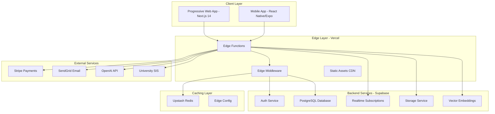
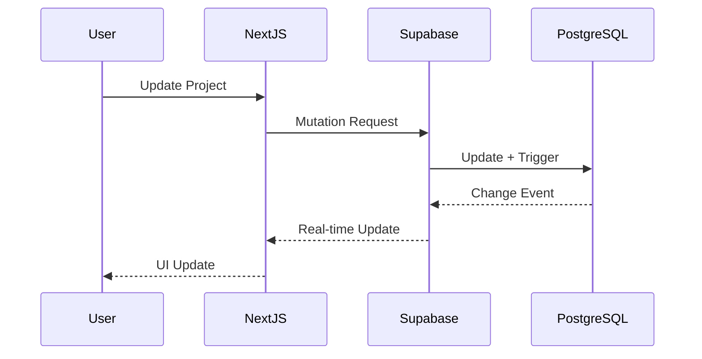
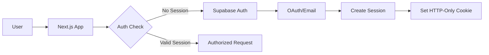

# Worktree v4 - Enhanced Technical Architecture

## Table of Contents
1. [System Overview](#system-overview)
2. [Architecture Principles](#architecture-principles)
3. [Technology Stack](#technology-stack)
4. [Component Architecture](#component-architecture)
5. [Data Flow Architecture](#data-flow-architecture)
6. [Security Architecture](#security-architecture)
7. [Performance Architecture](#performance-architecture)
8. [Deployment Architecture](#deployment-architecture)

## System Overview

Worktree v4 is a modern web application designed to bridge campus involvement with career readiness. Built on a serverless, edge-first architecture, it leverages cutting-edge technologies to deliver a fast, scalable, and secure platform.

### Architecture Diagram



## Architecture Principles

### 1. **Edge-First Design**
- Compute at the edge for minimal latency
- Global CDN distribution
- Regional data replication

### 2. **Serverless & Scalable**
- No server management
- Automatic scaling
- Pay-per-use pricing

### 3. **Security by Default**
- Zero-trust architecture
- End-to-end encryption
- FERPA compliance built-in

### 4. **Developer Experience**
- Type-safe from database to frontend
- Hot module replacement
- AI-assisted development

### 5. **Progressive Enhancement**
- Works without JavaScript
- Offline-first capabilities
- Graceful degradation

## Technology Stack

### Frontend
| Component | Technology | Justification |
|-----------|------------|---------------|
| Framework | Next.js 14 with App Router | Server Components, streaming, built-in optimizations |
| UI Library | React 18 | Concurrent features, suspense boundaries |
| Styling | Tailwind CSS + CSS Modules | Utility-first with component scoping |
| State Management | Zustand + React Query | Lightweight, performant, built-in caching |
| Forms | React Hook Form + Zod | Type-safe validation, excellent DX |
| Animation | Framer Motion | Declarative animations, gesture support |
| Charts | Recharts + D3 | Interactive analytics visualizations |

### Backend
| Component | Technology | Justification |
|-----------|------------|---------------|
| BaaS | Supabase | Complete backend solution, real-time subscriptions |
| Database | PostgreSQL 15 | JSONB support, full-text search, row-level security |
| Edge Functions | Deno Deploy | TypeScript-native, Web API compatible |
| File Storage | Supabase Storage | S3-compatible, integrated CDN |
| Cache | Upstash Redis | Serverless Redis, edge-compatible |
| Search | PostgreSQL FTS + pgvector | AI-powered semantic search |

### Infrastructure
| Component | Technology | Justification |
|-----------|------------|---------------|
| Hosting | Vercel | Edge runtime, preview deployments |
| CDN | Vercel Edge Network | Global distribution, smart caching |
| Monitoring | Vercel Analytics + Sentry | Real user monitoring, error tracking |
| CI/CD | GitHub Actions | Native integration, matrix builds |

## Component Architecture

### 1. **Micro-Frontend Architecture**
```typescript
// Feature-based module structure
/src
  /features
    /auth
      /components
      /hooks
      /api
      /types
    /skills
    /organizations
    /projects
    /analytics
  /shared
    /ui
    /utils
    /types
```

### 2. **Component Hierarchy**
```typescript
// Atomic Design Pattern
/components
  /atoms        // Buttons, Inputs, Labels
  /molecules    // SearchBar, SkillTag, UserAvatar
  /organisms    // ProjectCard, SkillMatrix, Dashboard
  /templates    // DashboardLayout, ProfileLayout
  /pages        // Complete page compositions
```

### 3. **Data Fetching Strategy**
```typescript
// Server Components for initial data
export default async function ProjectPage({ params }) {
  const project = await getProject(params.id);
  return <ProjectDetails project={project} />;
}

// Client Components for interactivity
'use client';
export function ProjectActions({ projectId }) {
  const { mutate } = useProjectMutation();
  // Interactive elements
}
```

## Data Flow Architecture

### 1. **Real-Time Data Flow**


### 2. **Caching Strategy**
```typescript
// Multi-layer caching
interface CacheStrategy {
  browser: {
    static: '1 year',     // Immutable assets
    dynamic: '5 minutes', // API responses
  },
  edge: {
    static: '1 year',
    dynamic: '60 seconds', // Stale-while-revalidate
  },
  database: {
    materialized_views: '5 minutes',
    query_cache: '60 seconds',
  }
}
```

## Security Architecture

### 1. **Authentication Flow**


### 2. **Row Level Security (RLS)**
```sql
-- Example RLS Policy
CREATE POLICY "Users can view their own data"
ON users FOR SELECT
USING (auth.uid() = id);

CREATE POLICY "Leaders can manage their org"
ON organizations FOR ALL
USING (
  EXISTS (
    SELECT 1 FROM organization_members
    WHERE organization_id = organizations.id
    AND user_id = auth.uid()
    AND role IN ('leader', 'advisor')
  )
);
```

### 3. **API Security**
- Rate limiting at edge
- CORS configuration
- Input validation with Zod
- SQL injection prevention
- XSS protection

## Performance Architecture

### 1. **Optimization Techniques**
- Server-side rendering for SEO
- Static generation for marketing pages
- Incremental Static Regeneration
- Image optimization with next/image
- Code splitting and lazy loading
- Resource hints (preconnect, prefetch)

### 2. **Database Optimization**
```sql
-- Optimized indexes
CREATE INDEX idx_projects_org_status 
ON projects(organization_id, status) 
WHERE status != 'archived';

-- Materialized views for analytics
CREATE MATERIALIZED VIEW skill_demand AS
SELECT 
  s.id,
  s.name,
  COUNT(DISTINCT prs.project_id) as project_count,
  COUNT(DISTINCT us.user_id) as user_count
FROM skills s
LEFT JOIN project_required_skills prs ON s.id = prs.skill_id
LEFT JOIN user_skills us ON s.id = us.skill_id
GROUP BY s.id, s.name;
```

### 3. **Performance Budgets**
- First Contentful Paint: < 1.2s
- Time to Interactive: < 2.5s
- Cumulative Layout Shift: < 0.1
- JavaScript bundle: < 200KB gzipped

## Deployment Architecture

### 1. **Environment Strategy**
```yaml
environments:
  development:
    url: localhost:3000
    supabase: local docker
  staging:
    url: staging.worktree.app
    supabase: staging project
  production:
    url: app.worktree.app
    supabase: production project
```

### 2. **CI/CD Pipeline**
```yaml
# GitHub Actions workflow
name: Deploy
on:
  push:
    branches: [main]
    
jobs:
  test:
    runs-on: ubuntu-latest
    steps:
      - uses: actions/checkout@v3
      - run: npm test
      - run: npm run type-check
      - run: npm run lint
      
  deploy:
    needs: test
    runs-on: ubuntu-latest
    steps:
      - uses: actions/checkout@v3
      - uses: vercel/action@v1
        with:
          vercel-token: ${{ secrets.VERCEL_TOKEN }}
```

### 3. **Monitoring & Observability**
- Real User Monitoring (RUM)
- Error tracking with Sentry
- Performance monitoring
- Custom analytics events
- Database query analysis

## Scaling Considerations

### Horizontal Scaling
- Serverless functions scale automatically
- Database read replicas for heavy loads
- CDN handles static asset distribution

### Vertical Scaling
- Supabase instance sizing
- Connection pooling optimization
- Query optimization

### Cost Optimization
- Aggressive caching strategies
- Efficient database queries
- Static generation where possible
- Image optimization and lazy loading

## Future Architecture Considerations

1. **Microservices Migration**
   - Extract heavy analytics to separate service
   - Dedicated notification service
   - AI/ML inference service

2. **Multi-Region Deployment**
   - Database replication
   - Edge function distribution
   - Compliance with data residency

3. **Advanced Features**
   - WebRTC for video interviews
   - Blockchain for skill verification
   - AR/VR for virtual events

This architecture provides a solid foundation for building a scalable, performant, and maintainable application while keeping development velocity high for a solo developer or small team.